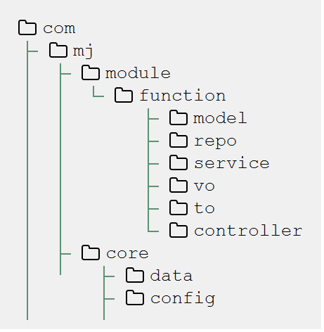
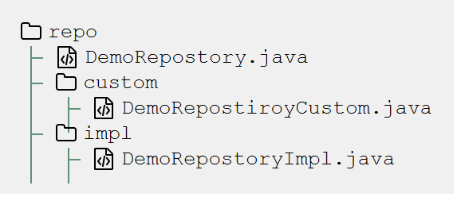

:toc: left
:sectnums:

= 项目规约文档
Doc Writer <bvvy@qq.com>
v1.0, 2018-07

== 编码规范

=== 总体文件夹结构

=== repo

[plantuml,docs/images/repoclass,png]
--
!pragma graphviz_dot jdot
interface DemoRepositoryCustom {
    void someCustomMethod()
}
interface DemoRepostory 
class DemoRepositoryImpl {
    EntityManager entityManager
    void someCustomMethod()
}

DemoRepositoryCustom <|-- DemoRepostory
DemoRepositoryCustom <|-- DemoRepositoryImpl
--

1. DemoRepository实现JpaRepository 和 RepositoryCustom存放与当前表的操作方法
2. Costom里面主要连表部分的方法和需要多条件模糊查询的方法
3. Impl实现Custom

=== service相关

1. service 中的错误处理统一抛出异常信息 不返回到controller中处理
2. 不同的模块service不要直接依赖 通过connectService依赖

=== controller相关

[source,java]
--
    @PostMapping
    public ResponseEntity<Messager> add(@Valid @RequestBody MenuAddDTO menuAddDTO, BindingResult br) {
        Menu menu = Menu.builder()
                .enabled(menuAddDTO.getEnabled())
                .name(menuAddDTO.getName())
                .orderNum(menuAddDTO.getOrderNum())
                .path(menuAddDTO.getPath())
                .pid(menuAddDTO.getPid())
                .build();
        menuService.add(menu);
        return Responser.created();
    }
--
1. 在类上使用@RestController 不用使用@Controller
2. 在方法上使用PostMapping GetMapping DeleteMapping PatchMapping
不能使用@RequestMapping
3. 不能直接返回model必须转成VO

=== model相关

1. 一律不能使用 Date类 使用LocalDate和LocalDateTime替代
2. 不要滥用继承，导致过多的无用字段

=== dto vo相关
1. dto 存放前端传递到后端的数据，必须做验证 规则是Hibernate Validation
2. vo 存放后端返回给前端的数据
3. dto vo 中不能相互继承导致前端无数个字段，全部重新写
4. dto vo上面必须写ApiModelProperties

=== 其他
1. 写注释
2. 提交代码是请详细写出该次提交的内容

include::docs/description.adoc[]
